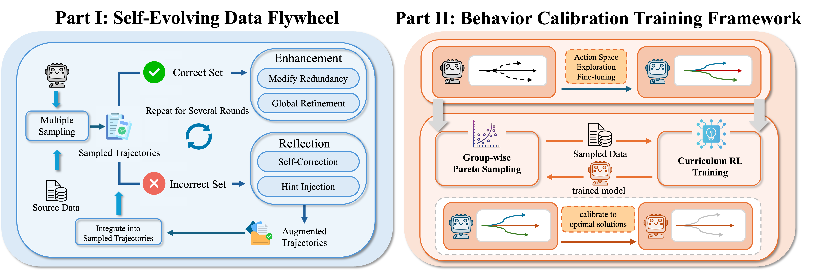
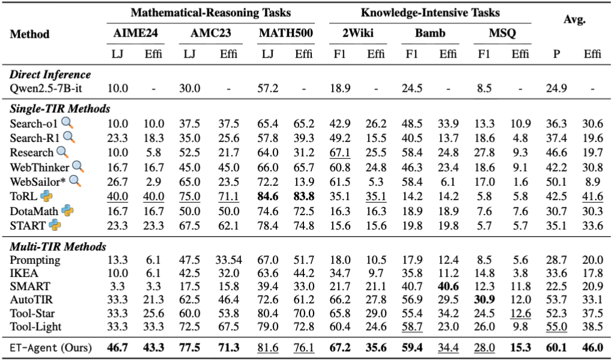

<h1 align="center"> 💡ET-Agent: Incentivizing Effective Tool-Integrated Reasoning Agent via Behavior Calibration</a></h1>

<!-- <div align="center"> 

[](https://huggingface.co/collections/dongguanting/arpo-688229ff8a6143fe5b4ad8ae)
[](https://modelscope.cn/models/dongguanting/arpo-688229ff8a6143fe5b4ad8ae)
[](https://opensource.org/licenses/MIT) 
[](https://www.python.org/downloads/release/python-390/) 
</div> -->


<!-- 
<div align="center">
  <a href="https://arxiv.org/abs/2509.23285">
    
  </a>
  <a href="https://huggingface.co/zhangboguodong/Tool-Light-Qwen2.5-7B-it">
    
  </a>
  <a href="https://modelscope.cn/models/zhangboguodong/Tool_Light_Qwen2.5_7B_it">
    
  </a>
  <a href="https://opensource.org/licenses/MIT">
    
  </a>
  <a href="https://www.python.org/downloads/release/python-390/">
    
  </a>
</div> -->

## 😃 Overview


**ET-Agent** is a framework focused on fully optimizing agents' behavioral patterns in TIR tasks. ET-Agent proceeds from data and algorithm aspects. On the data side, it uses the **Self-Evolving Data Flywheel** to generate a large amount of enhanced data, providing a data foundation for RFT to broaden the tool-use action space coverage. On the algorithm side, it introduces the **Behavior Calibration Training** framework to gradually calibrate the agent's behavioral patterns to the optimal state. Results across multiple dimensions on two types of reasoning tasks show that its performance is superior to commonly used multi-TIR methods.

<p align="center">

</p>
<!--  -->

## 😋 Quick Start for Data Construction
### 1. Environment Setup

<!-- In this step, we should first operate SFT on Qwen2.5-7B-Instruct model. Please first set up the environment for [Llama Factory](https://github.com/hiyouga/LLaMA-Factory). -->
We first set up all the required environments.

#### Environment for Evaluation
```bash
git clone https://github.com/asilverlight/ET-Agent/
cd ET-Agent/evaluation
conda create -n evaluation python=3.10
conda activate evaluation
pip install -r requirements.txt
```

#### Environment for LLM Server
```bash
cd ET-Agent/evaluation/vllm
conda create -n vllm python=3.10
conda activate vllm
pip install -r requirements.txt
```

#### Environment for Retrieval
```bash
cd ET-Agent/FlashRAG-main
conda create -n retrieval python=3.10
conda activate retrieval
pip install -r requirements.txt
```


#### Environment for RFT
```bash
cd ET-Agent/LLaMA-Factory
conda create -n rft python=3.10
conda activate rft
pip install -r requirements.txt
```

#### Environment for RL
```bash
cd ET-Agent/ARPO
conda create -n rl python=3.10
conda activate rl
pip install -r requirements.txt
```


### 2. Conduct Self-Evolving Data Flywheel

- Set up services for all required LLMs.

In a terminal, execute the following code:
```bash
cd ET-Agent/flywheel
conda activate vllm
bash vllm_launch_eval1.sh
```
In another terminal, execute the following code:
```bash
cd ET-Agent/flywheel
conda activate vllm
bash vllm_launch_evolve1.sh
```

- Deploy local retrieval service. We provide a Wikipedia retriever service implemented using FlashRAG and FastAPI. Before starting the retriever serving, you need to download the [pre-indexed Wikipedia, Wikipedia corpus](https://modelscope.cn/datasets/zhangboguodong/wiki2022), and [corresponding retriever models](https://huggingface.co/intfloat/e5-base-v2). Index construction method can be found [here](https://github.com/RUC-NLPIR/FlashRAG/tree/main?tab=readme-ov-file#rocket-quick-start).
More details can be found in the [FlashRAG documentation](https://github.com/RUC-NLPIR/FlashRAG/tree/main?tab=readme-ov-file#rocket-quick-start).
To start the retriever serving, first fill in `ET-Agent/retriever/serving_config.yaml` with the correct paths to the retrieval model, index, and corpus, as well as available GPU IDs. Then, run the following command to start the retriever serving:

```bash
python host_wiki.py \
    --config serving_config.yaml \
    --num_retriever {num_retriever} \
    --port {port}
```
- Run the Self-Evolving Data Flywheel.
```bash
cd ET-Agent/flywheel
conda activate evaluation
bash run.sh
```
Note that you need to set `CONDA_ENV` in `run.sh` to your environment path, and replace your `BING_API_KEY` and `BING_ZONE`. After that, replace `LOCAL_SEARCH_URL` with the port you set in `host_wiki.py` (the default is `0.0.0.0:1243`).
### 3. Conduct Action Space Exploration Fine-tuning
Execute the following code:
```bash
conda activate rft
cd ET-Agent/LLaMA-Factory/examples/train_full
bash train_sft.sh
```
### 4. Conduct Iterative Behavior Calibration Reinforcement Learning

- Conduct Group-wise Pareto Sampling.
First, directly guide the agent to sample several chains for each question in the original data.
In a terminal, execute the following code:
```bash
cd ET-Agent/direct_rollout
conda activate vllm
bash vllm_launch_infer1.sh
```
In another terminal, execute the following code:
```bash
cd ET-Agent/direct_rollout
conda activate vllm
bash vllm_launch_summarize_model1.sh
```
You should also deploy the local retrieval service.
Then, run the following code for executing direct rollout:
```bash
cd ET-Agent/direct_rollout
conda activate evaluation
bash run_direct_inference.sh
```
Note that you need to set `CONDA_ENV` in `run.sh` to your environment path, and replace your `BING_API_KEY` and `BING_ZONE`. After that, replace `LOCAL_SEARCH_URL` with the port you set in `host_wiki.py` (the default is `0.0.0.0:1243`).
Then, you can conduct pareto sampling on the data:
```bash
cd ET-Agent/pareto
conda activate evaluation
bash data_process.sh
```
You can get the train data for RL in `/path/to/ARPO/rl_datasets/train_processed_stage.parquet`.

- Conduct Curriculum RL Training
You can execute the RL code for each round in sequence:
```bash
cd ET-Agent/ARPO
conda activate rl
bash scripts/Efficiency_Qwen_7B_Stage.sh
```
<details>
<summary>🔍 Click here! Watch the details of train bash</summary>
  
```bash
SCRIPT_DIR="$( cd "$( dirname "${BASH_SOURCE[0]}" )" &> /dev/null && pwd )"
PARENT_DIR="$(dirname "$SCRIPT_DIR")"
cd "$PARENT_DIR"
echo "Switched to parent directory: $PARENT_DIR"


# ============================ Environment Setup ============================
# Set basic environment variables
export PYTHONUNBUFFERED=1            
export HYDRA_FULL_ERROR=1           
export VLLM_ATTENTION_BACKEND=XFORMERS 
export VERL_LOGGING_LEVEL=DEBUG
export MKL_SERVICE_FORCE_INTEL=1    
export MKL_THREADING_LAYER=GNU       
export RAY_memory_usage_threshold=0.8  
export RAY_memory_monitor_refresh_ms=0 
export CUDA_VISIBLE_DEVICES=0,1,2,3

# Set Python path
export PYTHONPATH="/path/to/ARPO"/verl_arpo_entropy:$PYTHONPATH

# ============================ Basic Configuration ============================
# Experiment name and project
PROJECT_NAME="reasoning_tasks" # Modify experiment group
EXPERIMENT_NAME="Efficiency_Qwen_7B_Stage1" # Modify experiment name

# Configuration file path
CONFIG_PATH="/path/to/ARPO/scripts/config" # Modify the absolute path of the config folder, relative path is not recommended
CONFIG_NAME="ppo_trainer.yaml"

# Distributed training settings
NNODES=1                            
N_GPUS_PER_NODE=4                  

# ============================ Data Configuration ============================
# Data parameters
PROMPT_KEY="prompt"                 # Prompt field name
TRAIN_BATCH_SIZE=64                # Training batch size
PPO_MINI_BATCH_SIZE=4              # PPO mini-batch size
MAX_PROMPT_LENGTH=2000              # Maximum prompt length
MAX_RESPONSE_LENGTH=4096            # Maximum response length

# Data file paths
TRAIN_FILES="/path/to/ARPO/rl_datasets/train_processed_stage1.parquet" # Modify training data path
VALID_FILES="/path/to/ARPO/rl_datasets/valid.parquet" # Modify validation data path

# ============================ Model Configuration ============================
# Actor model path
ACTOR_MODEL_PATH="/path/to/output/sft" # Modify training model path

# ============================ Rollout Configuration ==========================
# Rollout settings
ROLLOUT_NAME="vllm"                 # Use vllm engine
ROLLOUT_MODE="sync_with_tool"       # Synchronous mode with tool support
ROLLOUT_N=16                         # Number of responses generated per sample
INITIAL_ROLLOUTS=8                 # Initial rollout number
BEAM_SIZE=2                        # Beam size
BRANCH_PROBABILITY=0.5             # Branch probability
Entropy_weight=0.2
SIGMA_TOOL=0.0
SIGMA_LENGTH=0.0
# ============================ Rollout Tools Configuration ==========================
SEARCH_CACHE_PATH="/path/to/ARPO/search_cache/search_cache.json" # Modify

# ============================ Reward Model Configuration ==========================
# Reward model settings
REWARD_MANAGER="efficiency"              # Reward manager type
CUSTOM_REWARD_FUNCTION_PATH="/path/to/ARPO/verl_arpo_entropy/verl/utils/reward_score/efficiency.py"
CUSTOM_REWARD_FUNCTION_NAME="compute_score"

# ============================ Training Configuration ============================
# Training parameters
TOTAL_EPOCHS=3                      # Total training epochs
SAVE_FREQ=30                        # Save frequency
TEST_FREQ=10                        # Test frequency

# ============================ Path Configuration ============================
# Save path
SAVE_PATH="/path/to/output/${EXPERIMENT_NAME}" # Modify save path
ROLLOUT_SAVE_PATH="${SAVE_PATH}/rollout"

# ============================ WandB Configuration ============================
# WandB settings
WANDB_API_KEY="your_wandb_api_key" # Modify your wandb key
# SEARCH_CLASS_PATH="verl.workers.agent.tools.search_tool.BingSearchTool"
SEARCH_CLASS_PATH="verl.workers.rollout.tools.search_tool.LocalSearchTool"
LOCAL_SEARCH_URLS="your_local_search_url"
# ============================ Preparation ============================
# Login to WandB (if API key is provided)
if [ "$WANDB_API_KEY" != "" ]; then
    # export WANDB_BASE_URL="https://api.bandw.top"   
    wandb login --relogin $WANDB_API_KEY
    export WANDB_DIR=${SAVE_PATH}
fi

# Create save directory
if [ ! -d "$SAVE_PATH" ]; then
    mkdir -p $SAVE_PATH
fi

# Create rollout save directory
if [ ! -d "$ROLLOUT_SAVE_PATH" ]; then
    mkdir -p $ROLLOUT_SAVE_PATH
fi

# ============================ Start Training ============================
python3 -m verl.trainer.main_ppo \
    --config-path=$CONFIG_PATH \
    --config-name=$CONFIG_NAME \
    algorithm.adv_estimator=grpo \
    algorithm.kl_ctrl.kl_coef=0.0 \
    data.train_files=${TRAIN_FILES} \
    data.val_files=${VALID_FILES} \
    data.prompt_key=${PROMPT_KEY} \
    data.train_batch_size=${TRAIN_BATCH_SIZE} \
    data.max_prompt_length=${MAX_PROMPT_LENGTH} \
    data.max_response_length=${MAX_RESPONSE_LENGTH} \
    actor_rollout_ref.model.path=${ACTOR_MODEL_PATH} \
    actor_rollout_ref.model.enable_gradient_checkpointing=True \
    actor_rollout_ref.model.use_remove_padding=True \
    actor_rollout_ref.actor.optim.lr=1e-6 \
    actor_rollout_ref.actor.ppo_mini_batch_size=${PPO_MINI_BATCH_SIZE} \
    actor_rollout_ref.actor.use_dynamic_bsz=True \
    actor_rollout_ref.actor.ppo_max_token_len_per_gpu=$((2*(MAX_PROMPT_LENGTH+MAX_RESPONSE_LENGTH))) \
    actor_rollout_ref.actor.use_kl_loss=True \
    actor_rollout_ref.actor.kl_loss_coef=0.0 \
    actor_rollout_ref.actor.kl_loss_type=low_var_kl \
    actor_rollout_ref.actor.fsdp_config.param_offload=False \
    actor_rollout_ref.actor.fsdp_config.optimizer_offload=False \
    actor_rollout_ref.rollout.log_prob_max_token_len_per_gpu=$((4*(MAX_PROMPT_LENGTH+MAX_RESPONSE_LENGTH))) \
    actor_rollout_ref.rollout.tensor_model_parallel_size=1 \
    actor_rollout_ref.rollout.name=${ROLLOUT_NAME} \
    actor_rollout_ref.rollout.mode=${ROLLOUT_MODE} \
    actor_rollout_ref.rollout.gpu_memory_utilization=0.5 \
    actor_rollout_ref.rollout.n=${ROLLOUT_N} \
    actor_rollout_ref.rollout.initial_rollouts=${INITIAL_ROLLOUTS} \
    actor_rollout_ref.rollout.beam_size=${BEAM_SIZE} \
    actor_rollout_ref.rollout.branch_probability=${BRANCH_PROBABILITY} \
    actor_rollout_ref.rollout.entropy_weight=${Entropy_weight} \
    actor_rollout_ref.rollout.tools.tool_instances.search.use_local_search=True \
    actor_rollout_ref.rollout.tools.tool_instances.search.params.localsearch.local_search_url=${LOCAL_SEARCH_URLS} \
    actor_rollout_ref.rollout.tools.tool_instances.search.params.localsearch.max_results=4 \
    actor_rollout_ref.rollout.tools.tool_instances.search.params.localsearch.max_document_length=1200 \
    actor_rollout_ref.rollout.multi_turn.enable=${ENABLE_MULTI_TURN} \
    actor_rollout_ref.ref.log_prob_max_token_len_per_gpu=$((4*(MAX_PROMPT_LENGTH+MAX_RESPONSE_LENGTH))) \
    actor_rollout_ref.ref.fsdp_config.param_offload=False \
    reward_model.reward_manager=${REWARD_MANAGER} \
    reward_model.reward_kwargs.sigma_tool=${SIGMA_TOOL} \
    reward_model.reward_kwargs.sigma_length=${SIGMA_LENGTH} \
    custom_reward_function.path=${CUSTOM_REWARD_FUNCTION_PATH} \
    custom_reward_function.name=${CUSTOM_REWARD_FUNCTION_NAME} \
    trainer.critic_warmup=0 \
    trainer.logger="[console, wandb]" \
    trainer.project_name=${PROJECT_NAME} \
    trainer.experiment_name=${EXPERIMENT_NAME} \
    trainer.n_gpus_per_node=${N_GPUS_PER_NODE} \
    trainer.nnodes=${NNODES} \
    trainer.save_freq=${SAVE_FREQ} \
    trainer.test_freq=${TEST_FREQ} \
    trainer.total_epochs=${TOTAL_EPOCHS} \
    trainer.default_local_dir=${SAVE_PATH} \
    trainer.val_before_train=False \
    trainer.rollout_data_dir=${ROLLOUT_SAVE_PATH} \
    hydra.run.dir=${SAVE_PATH}/outputs 2>&1 | tee ${SAVE_PATH}/run.log
```

</details>
You need to set `PROJECT_NAME`, `EXPERIMENT_NAME`, `CONFIG_PATH`, `TRAIN_FILES`, `VALID_FILES`, `ACTOR_MODEL_PATH`, `SEARCH_CACHE_PATH`, `CUSTOM_REWARD_FUNCTION_PATH`, `SAVE_PATH`, `WANDB_API_KEY`, `LOCAL_SEARCH_URLS` in the script. Besides, you should also set `conda_path` and `conda_env` in `ARPO/scripts/config/ppo_trainer.yaml`.

### 5. Evaluate the Performance of Trained Model
In terms of the Correctness and efficiency metrics, ET-Agent achieves optimal performance in most cases across six difficult tasks, surpassing a range of baselines. For the metrics of Conciseness, Successful Execution, and Reasoning Length, ET-Agent also achieves the best average performance, outperforming six commonly used multi-TIR methods.
<p align="center">

</p>
<p align="center">

</p>
- Deploy the local retrieval service.

- Deploy the reasoning model:
```bash
cd ET-Agent/evaluation
conda activate vllm
bash vllm_launch_reasoning_model-1.sh
```
- Deploy the summarization model:
```bash
cd ET-Agent/evaluation
conda activate vllm
bash vllm_launch_summarization_model-1.sh
```
- Begin for inference:
```bash
cd ET-Agent/evaluation
conda activate evaluation
bash infer_local_sds.sh
```
You need to set `MODEL_PATH`, `OUTPUT_PATH`, `CONDA_ENV`, `BING_API_KEY`, `BING_ZONE`, `SUMM_MODEL_PATH`, `SEARCH_CACHE_FILE`, `URL_CACHE_FILE`, `LOCAL_SEARCH_URL` in `infer_local_sds.sh`.
- After that, you can test the metrics of the model:
Deploy the judging model:
```bash
cd ET-Agent/evaluation
conda activate vllm
bash evaluate/deploy_qwen2.5_72B_instruct.sh
```
Then, run the code in `ET-Agent/evaluation/evaluate_all_datas.sh` to evaluate the performance of the model. Here, we evaluate the **F1 score**, **LLM-as-Judge**, and **Efficiency** metric:
```bash
bash evaluate/evaluate_all_datas.sh
```

- For the measurement of the **Conciseness**, **Successful Execution**, and **Reasoning Length** metrics, please run `ET-Agent/radar/run.sh`:

First, deploy the judgement model:
```bash
cd ET-Agent/radar
conda activate vllm
bash serve_model.sh
```
Then, you can run `ET-Agent/radar/run.sh`. You need to set `methods_paths` in `run.sh`.
```bash
cd ET-Agent/radar
conda activate evaluation
bash run.sh
```

